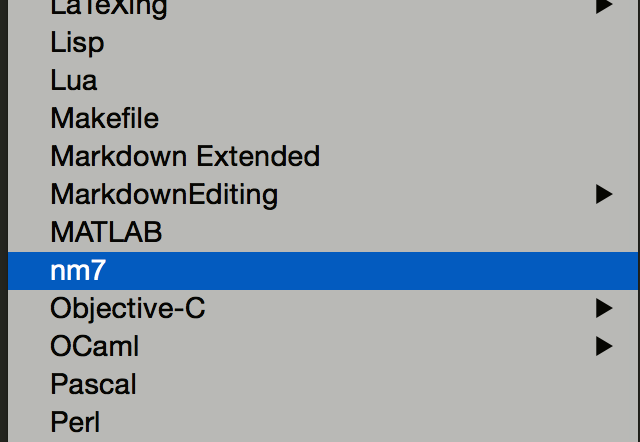

## README
 This is a basic syntax highlighter for NONMEM model files written for SublimeText2/3. Currently it supports NONMEM7. It is still buggy but mostly functional. Feel free to make changes and contribute.

## Installation Procedure

1. download and install [SublimeText3](http://www.sublimetext.com/3)
2. download the nm_highlighter repository
3. unzip `non.tmLanguage`
4. Open Sublime and go to Preferences --> Browse Packages and it will open a new windows explorer window

5. Drop in the non.tmLanguage file into the folder that was opened (along the lines of Roaming/Sublime Text 3/Packages on windows)

6. Close and re-open Sublime Text. Upon re-opening you can check the syntax highlighter was installed by clicking on the bottom right corner and checking if `nm7` is one of the options.

## Example

### Attribution

Authors:
* [Ron Keizer](https://github.com/ronkeizer)
* [Vijay Ivaturi](https://github.com/vjd)
* [Devin Pastoor](https://github.com/dpastoor)
